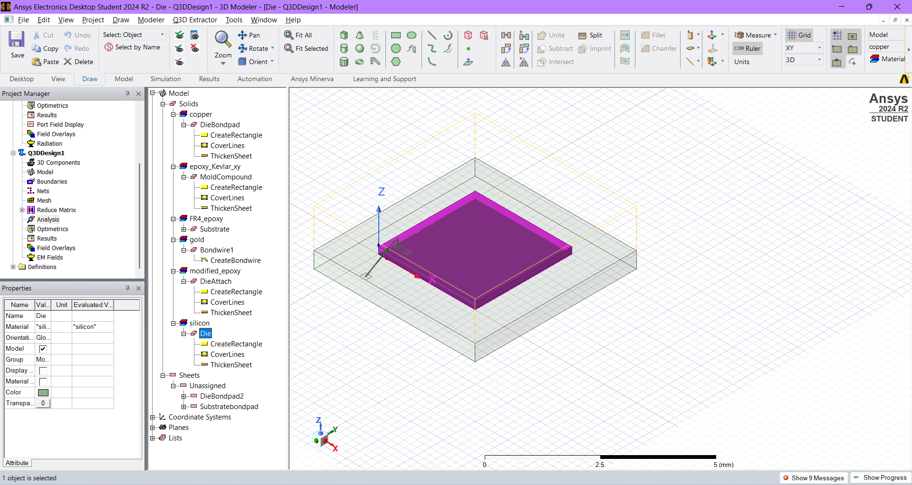

#  NASSCOM Semiconductor Packaging Workshop (July 4–13, 2025)

**Organized by:** VSD Corp. Pvt. Ltd. https://www.vlsisystemdesign.com/

**In collaboration with:** [NASSCOM FutureSkills Prime](https://futureskillsprime.in/)  
**Mode:** Online (10-Day Hands-on Workshop)  
**Tools Used:** ANSYS SIwave, ANSYS RedHawk ICEpak, DRC Tools

---

##  Workshop Overview

This 10-day intensive workshop focused on the complete lifecycle of semiconductor packaging — from fundamentals to advanced simulation and reliability testing. The program emphasized practical exposure using industry-standard EDA tools, covering both design theory and real-world packaging flows such as 2.5D/3D integration, co-design, and qualification techniques.

---

## 🗓️ Daily Activity Summary

| Day     | Topic                                         | Highlights                                                                 |
|---------|-----------------------------------------------|---------------------------------------------------------------------------|
| Day 1   | Introduction to Semiconductor Packaging        | Evolution of packaging, OSAT/Foundry ecosystem, packaging types           |
| Day 2   | Types of Packaging & Advanced Trends           | Wire bonding, flip-chip, WLCSP, 2.5D/3D integration, fan-out BGA          |
| Day 3   | Package Layout & DRC Analysis                  | Bump layout, DRC rules, substrate planning                                |
| Day 4   | Chip-Package-PCB Co-design Concepts            | Cross-domain design synchronization, parasitic concerns                   |
| Day 5   | Signal Integrity (SI) & Power Integrity (PI)   | Impedance matching, PDN planning, decoupling strategies                   |
| Day 6   | Thermal Analysis & Simulation                  | Heat flow modeling, junction temperature, ANSYS RedHawk ICEpak hands-on   |
| Day 7   | Reliability & Stress Qualification             | Burn-in, HAST, HTOL testing principles, failure modes                     |
| Day 8   | Failure Analysis & Yield Optimization          | Root-cause debugging, reliability-driven design changes                   |
| Day 9   | Hands-on with ANSYS Tools                      | SI/PI simulation, thermal-aware layout, DRC violations                    |
| Day 10  | Capstone Simulation Project & Q&A              | Final project using ANSYS + expert discussion                             |

---

##  Semiconductor Package Construction – Visual Stack

Below is the **visual representation of package construction** from **top to bottom**, illustrating each physical layer of a typical wire-bonded package.

| Layer | Description | Image |
|-------|-------------|-------|
|  **Mold Compound** | Encapsulates and protects the internal components from mechanical and environmental damage. |  |
|  **Bondwire** | Thin gold/aluminum wires used to connect the die pads to the substrate/package leads. |  |
|  **Die** | The silicon chip that contains the functional circuitry. |  |
|  **Die Bond Pad** | Metal pads on the die for electrical interconnection via bonding wires. |  |
|  **Die Attach** | Adhesive or solder layer that secures the die to the substrate. |  |
|  **Substrate** | The base platform that supports the die and routes electrical signals to the PCB. |  |

> Each of these layers plays a critical role in signal transmission, heat dissipation, and mechanical reliability.

---

##  Key Outcomes

- Learned full-stack packaging flow including DRC, SI/PI, thermal, and reliability analysis  
- Applied **ANSYS RedHawk ICEpak** and **SIwave** to simulate realistic packaging conditions  
- Understood co-design challenges in 2.5D/3D and chiplet-based systems  
- Gained practical insight into stress qualification and root-cause analysis  
- Completed a hands-on **capstone project** simulating a real-world package

---
## Achnowledgements

-[Kunal Ghosh](https://github.com/kunalg123)

-[Tarun Agarwal](https://iitgn.ac.in/faculty/ee/fac-tarun)Professor IIT-Gandhinagar

